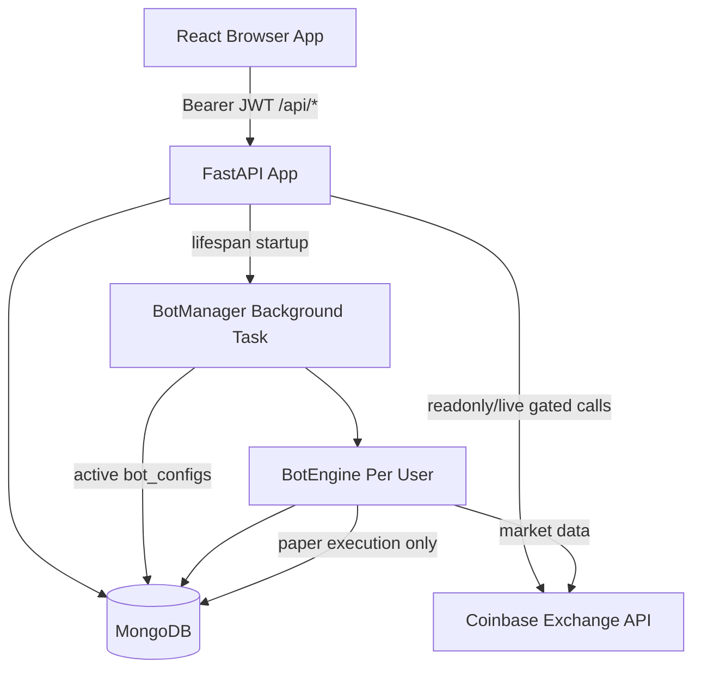
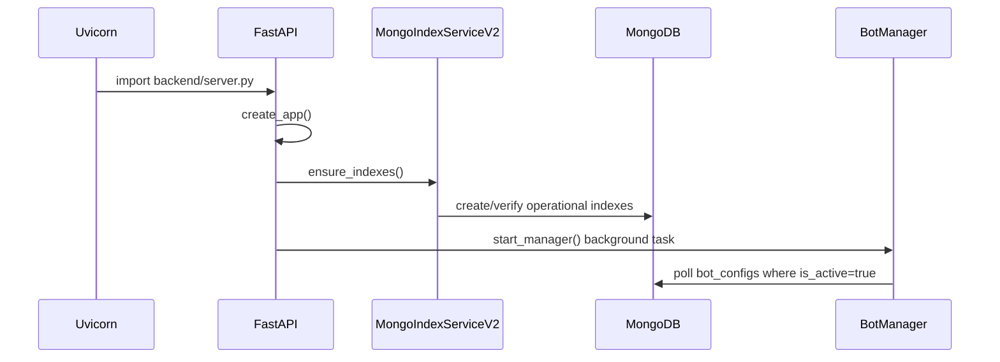
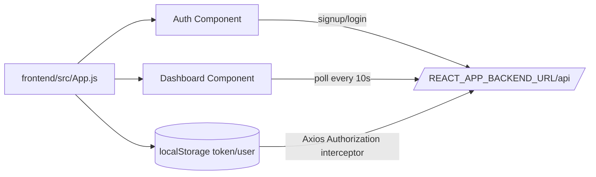
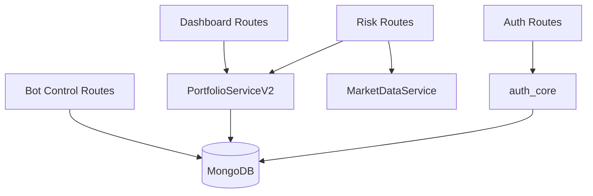
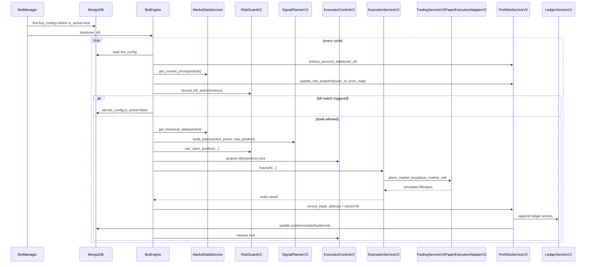
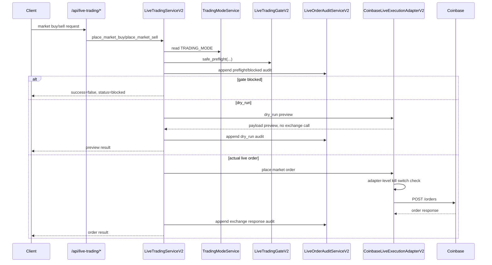
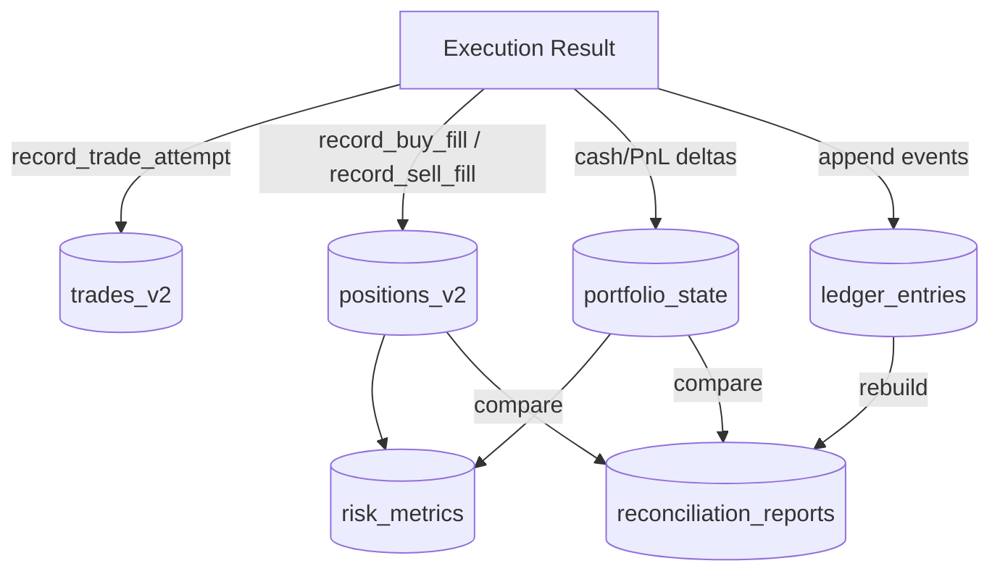
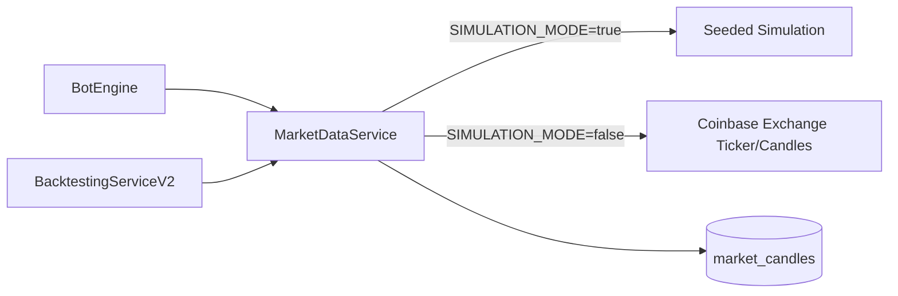
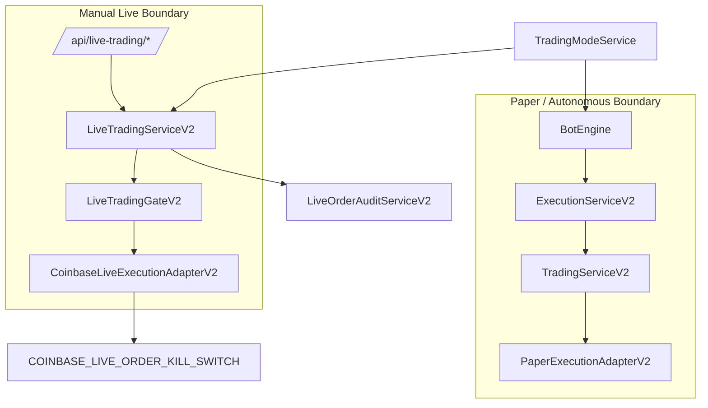
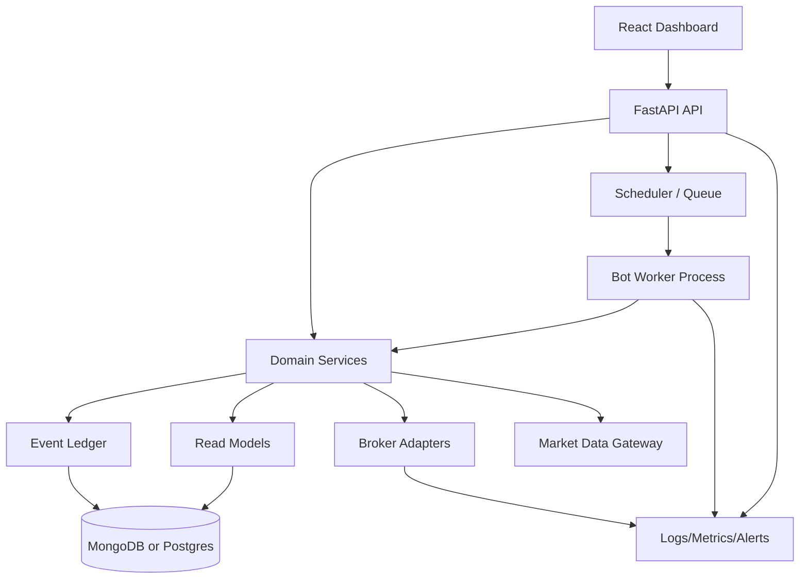

# Architecture Map

This document maps the current system architecture for the Autonomous Trading Bot. It is intended to be the canonical high-level reference for contributors before making execution, risk, ledger, or live-trading changes.

## Current System Status

The system is a FastAPI + MongoDB backend with a React dashboard frontend.

The autonomous bot path is paper/simulation execution only:

```text
BotManager -> BotEngine -> ExecutionServiceV2 -> TradingServiceV2 -> PaperExecutionAdapterV2
```

Manual live-trading endpoints exist separately and are intentionally routed through a fail-closed gate:

```text
/api/live-trading/* -> LiveTradingServiceV2 -> LiveTradingGateV2 -> CoinbaseLiveExecutionAdapterV2
```

Live autonomous trading is not implemented. `TradingModeService.assert_can_trade()` rejects normal bot execution when `TRADING_MODE=live-trading`; real order submission must use `LiveTradingServiceV2`.

---

## Runtime Topology



### Startup lifecycle



---

## Backend Entry Points

| File | Responsibility |
|---|---|
| `backend/server.py` | ASGI entry point; exposes `app = create_app()` |
| `backend/app_factory.py` | Creates FastAPI app, health/readiness endpoints, router inclusion, CORS middleware |
| `backend/app_state.py` | Loads `.env`, configures logging, creates Mongo client/db handle, password context, auth bearer, and starts `BotManager` during lifespan |
| `backend/api_routes.py` | Re-exports current router from `api_routes_v3` |
| `backend/api_routes_v2.py` | Core auth/dashboard/bot/portfolio/risk endpoints |
| `backend/api_routes_v3.py` | Backtest, ledger, live-readonly, gated live-trading, and ops endpoints |

---

## Frontend Architecture



### Frontend behavior

- `App.js` reads `REACT_APP_BACKEND_URL` and exports `API` as `${BACKEND_URL}/api`.
- Axios attaches `Authorization: Bearer <token>` from `localStorage` to requests.
- `Dashboard.js` polls dashboard, trades, positions, risk metrics, and bot config every 10 seconds.
- Bot start/stop is controlled through `/api/bot/start` and `/api/bot/stop`.

---

## API Surface

### Core API



Key endpoints:

| Endpoint | Purpose |
|---|---|
| `POST /api/auth/signup` | Create user, default bot config, issue JWT |
| `POST /api/auth/login` | Verify credentials, issue JWT |
| `GET /api/dashboard/stats` | Aggregate portfolio/dashboard summary |
| `GET /api/trades` | List recent trades |
| `GET /api/positions` | List marked positions |
| `GET /api/risk-metrics` | Return latest risk snapshot |
| `GET /api/bot-config` | Return authenticated user bot config |
| `POST /api/bot-config` | Update authenticated user bot config |
| `POST /api/bot/start` | Activate autonomous paper bot |
| `POST /api/bot/stop` | Deactivate autonomous bot |

### Advanced API

| Endpoint | Purpose |
|---|---|
| `POST /api/backtests/run` | Run moving-average backtest from candles |
| `POST /api/backtests/walk-forward` | Run walk-forward validation |
| `GET /api/ledger/entries` | List append-only ledger entries |
| `POST /api/ledger/rebuild` | Rebuild account state from ledger |
| `POST /api/ledger/reconcile` | Compare current read models to ledger-derived state |
| `POST /api/live-readonly/snapshot` | Fetch live readonly account/market snapshot |
| `POST /api/live-readonly/reconcile` | Compare exchange state to internal state |
| `GET /api/live-readonly/orders` | Fetch recent exchange orders |
| `GET /api/live-readonly/fills` | Fetch recent exchange fills |
| `GET /api/live-trading/gate` | Describe live-trading gate state |
| `POST /api/live-trading/market-buy` | Manually submit/preview gated live market buy |
| `POST /api/live-trading/market-sell` | Manually submit/preview gated live market sell |
| `GET /api/live-trading/audits` | List live-order audit records |
| `GET /api/ops/readiness` | Operational readiness check |
| `POST /api/ops/indexes/ensure` | Create/verify Mongo indexes |
| `POST /api/ops/emergency-halt` | Deactivate authenticated user's bot configs |

---

## Autonomous Bot Execution Path



### Invariants

- Bot execution must remain on `ExecutionServiceV2 -> TradingServiceV2`.
- `TradingServiceV2` delegates to `PaperExecutionAdapterV2`.
- Normal bot execution must not call `CoinbaseLiveExecutionAdapterV2`.
- `TradingModeService.assert_can_trade()` blocks normal execution in `live-readonly` and `live-trading` modes.
- Risk kill switches must be evaluated before order planning/execution.
- Execution locks and idempotency keys protect against duplicate paper orders.

---

## Manual Gated Live-Trading Path



### Live-trading gates

Live orders are fail-closed unless all required conditions pass:

- `TRADING_MODE=live-trading`
- `LIVE_TRADING_ENABLED=True`
- `LIVE_EXECUTION_ADAPTER=coinbase_exchange_v2`
- user bot config has `live_trading_enabled=True`
- symbol is allowlisted
- notional is positive and below max order notional
- manual approval passes when required
- adapter-level kill switch is not enabled

---

## Portfolio, Ledger, and Accounting Model



### Ledger event model

| Event | Meaning |
|---|---|
| `BUY_FILL` | Base acquired and cash spent |
| `SELL_FILL` | Base sold and net cash received |
| `REALIZED_PNL` | Realized profit/loss event for sell fills |
| `FEE` | Fee accounting event |

### Read models

| Collection | Purpose |
|---|---|
| `portfolio_state` | Fast account-level cash/equity/PnL read model |
| `positions_v2` | Fast per-symbol open-position read model |
| `trades_v2` | Trade-attempt/fill history |
| `risk_metrics` | Time-series risk snapshots |
| `ledger_entries` | Append-only accounting source of truth |
| `reconciliation_reports` | Ledger/read-model consistency reports |

---

## Market Data Model



The service supports both current ticker retrieval and candle retrieval. In simulation mode it generates deterministic seeded synthetic prices/candles. In non-simulation mode it fetches Coinbase Exchange ticker/candle data and fails closed when data is unavailable.

---

## Persistence Map

| Collection | Written by | Read by | Notes |
|---|---|---|---|
| `users` | `auth_core.signup` | `auth_core.login`, `get_current_user` | User identity and password hash |
| `bot_configs` | signup, bot config routes, bot start/stop, emergency halt | BotManager, BotEngine, live gate | Per-user operating config |
| `portfolio_state` | PortfolioServiceV2 | dashboard, risk, reconciliation | Account read model |
| `positions_v2` | PortfolioServiceV2 | dashboard, risk, reconciliation | Position read model |
| `trades_v2` | PortfolioServiceV2 | dashboard, performance metrics | Trade history/read model |
| `risk_metrics` | PortfolioServiceV2 | dashboard, risk endpoints | Time-series snapshots |
| `ledger_entries` | LedgerServiceV2 | ledger/reconciliation endpoints | Accounting source of truth |
| `reconciliation_reports` | LedgerServiceV2 | operators/debugging | Consistency reports |
| `market_candles` | MarketDataService | backtests/stored candles | Unique by symbol/exchange/timeframe/open_time |
| `live_order_audits` | LiveOrderAuditServiceV2 | live audit routes | Hash-chained privileged action log |
| `live_readonly_reports` | LiveReadonlyServiceV2 | live-readonly reconciliation | Exchange/internal comparison reports |
| `execution_locks` | ExecutionControlV2 | BotEngine execution flow | Duplicate-order protection |
| `alerts` | AlertService | alert endpoints/dashboard future | Operational/user alerts |

---

## Safety Boundaries



### Critical safety rules

1. Do not inject `CoinbaseLiveExecutionAdapterV2` into `ExecutionServiceV2` or `TradingServiceV2`.
2. Do not allow autonomous bot cycles to submit live orders.
3. Preserve `TradingModeService.assert_can_trade()` semantics.
4. Keep live execution behind `LiveTradingServiceV2` and `LiveTradingGateV2`.
5. Keep `dry_run=True` default for live-trading request models.
6. Preserve adapter-level kill switch behavior.
7. Preserve hash-chained audits for every live order preflight and adapter result.
8. Preserve ledger/read-model reconciliation tests when modifying accounting.

---

## Known Architectural Debt

These are not necessarily bugs, but they are the next design pressure points:

1. **Global app state:** database/auth/bot manager are module-level globals, which makes isolated testing and multi-instance deployment harder.
2. **Route modules import services directly:** dependency injection is limited; test seams are manual.
3. **Frontend stores JWT in localStorage:** convenient, but weaker than secure cookie/session architecture for production.
4. **Bot manager starts with API process:** production should separate API and worker processes or add leader election.
5. **No formal domain layer:** trading, accounting, risk, execution, and persistence are service-based but not yet strict clean architecture.
6. **Live endpoints lack role/MFA boundary:** authenticated user is enough today; production live execution should require stronger authorization.
7. **Market data is service-local:** no explicit market-data freshness SLA or cache policy beyond stored candles.
8. **No formal event bus:** workflows are synchronous service calls; future scale may need queued jobs/events.

---

## Recommended Target Architecture



Target evolution:

- Split API server and bot worker.
- Move from module-level globals to explicit dependency wiring.
- Introduce stronger domain models for orders, fills, positions, ledger events, risk decisions, and execution decisions.
- Add event queue for bot cycles and reconciliation jobs.
- Move live trading to scoped authorization + MFA + signed approval challenge.
- Add observability with structured metrics, traces, and alert policies.

---

## Contributor Checklist

Before changing execution, risk, or ledger code:

- [ ] Does this preserve autonomous paper-only execution?
- [ ] Does this preserve live trading gate behavior?
- [ ] Does this preserve adapter-level kill switch behavior?
- [ ] Does this add or update ledger reconciliation tests?
- [ ] Does this preserve idempotency and execution locks?
- [ ] Does this fail closed when market data is unavailable?
- [ ] Does this avoid writing live credentials or approval tokens to logs?
- [ ] Does this update this architecture document if boundaries changed?
