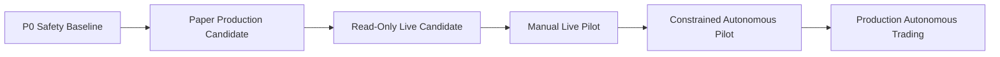

# Production Roadmap

This roadmap defines the path from the current paper/simulation prototype to a production-grade trading system. It is intentionally gate-based: a phase is not complete until its acceptance criteria and operational evidence are satisfied.

## Current Baseline

The repository currently has:

- FastAPI backend with MongoDB persistence.
- React dashboard frontend.
- JWT-based authentication.
- Paper/simulation autonomous bot execution.
- Gated manual live Coinbase execution endpoints.
- Live-readonly Coinbase integration.
- Portfolio, ledger, reconciliation, risk, backtesting, alerts, and operational readiness services.
- P0 live-trading hardening.
- Runtime bug-fix pass.
- Architecture map.
- Initial security-hardening pass.

The system is **not production-ready for autonomous live trading**. The safe current operating mode is paper/simulation.

---

## Production Philosophy

Production readiness is not a single deployment event. It requires evidence across six dimensions:

1. **Correctness** — accounting, ledger, execution, and reconciliation are deterministic and test-proven.
2. **Safety** — live execution is fail-closed, approval-gated, and bounded by hard risk controls.
3. **Security** — access, secrets, sessions, infrastructure, and privileged operations are hardened.
4. **Reliability** — the bot survives restarts, partial failures, market-data outages, and duplicate execution attempts.
5. **Observability** — every material decision and state transition is auditable.
6. **Operability** — deployment, rollback, incident response, and kill-switch procedures are documented and rehearsed.

---

## Release Stages



| Stage | Mode | Objective | Live Funds |
|---|---|---|---|
| P0 | Paper/simulation | Fail-closed safety baseline | No |
| P1 | Paper production candidate | Stable paper execution with CI/CD and observability | No |
| P2 | Live-readonly | Exchange data/account reconciliation without orders | No order placement |
| P3 | Manual live pilot | Human-approved tiny notional orders | Yes, tightly capped |
| P4 | Constrained autonomous pilot | Autonomous live execution under hard caps | Yes, limited |
| P5 | Production autonomous trading | Scaled live operations | Yes, governed |

---

## P1 — Paper Production Candidate

### Goal

Make the paper bot deployable as a stable production-style service with no live order risk.

### Engineering Work

- Split runtime roles:
  - API server
  - bot worker
  - scheduled reconciliation worker
- Add GitHub Actions CI:
  - backend pytest
  - frontend build
  - linting
  - dependency audit
  - secret scanning
- Add typed settings module using `pydantic-settings` or equivalent.
- Add structured app configuration report with redacted secrets.
- Add database migration/index bootstrap command separate from normal request path.
- Add API request IDs/correlation IDs.
- Add centralized error schema.
- Add frontend API error handling normalization.
- Add production Dockerfiles and compose profile.
- Add explicit `paper` deployment profile.

### Testing Requirements

- Unit tests for all pure domain logic.
- Integration tests for:
  - auth
  - bot config
  - bot start/stop
  - paper buy/sell flow
  - ledger reconciliation
  - risk kill switch
  - market-data unavailable path
- End-to-end smoke test:
  - signup
  - start bot
  - allow one cycle
  - verify trade attempt / position / ledger / risk snapshot
  - stop bot
- Minimum backend coverage target: 80% initially, then 90%.

### Acceptance Criteria

- `TRADING_MODE=paper` is the only order-producing autonomous mode.
- CI passes on every PR.
- App can be deployed from clean environment using documented commands.
- Restarting the app does not duplicate orders.
- Paper ledger reconciliation passes after bot cycles.
- `/readyz?strict=true` fails if config is unsafe.

---

## P2 — Live-ReadOnly Candidate

### Goal

Use live exchange account and market data without permitting order submission.

### Engineering Work

- Harden Coinbase readonly adapter:
  - request timeouts
  - retry policy for idempotent reads only
  - response schema validation
  - credential redaction
  - explicit error taxonomy
- Add live-readonly reconciliation schedule.
- Store exchange snapshots with immutable metadata:
  - adapter version
  - credential alias, not raw credential
  - request timestamp
  - response timestamp
  - checksum/hash
- Add freshness SLA for market data and account snapshots.
- Add drift reports between internal state and exchange state.
- Add alerts for:
  - stale market data
  - failed exchange read
  - reconciliation mismatch
  - missing credentials

### Testing Requirements

- Mocked Coinbase readonly integration tests.
- Contract tests for expected response shape.
- Failure-path tests for:
  - 401/403 credentials error
  - 429 rate limit
  - 5xx exchange outage
  - malformed exchange response
  - stale data

### Acceptance Criteria

- `TRADING_MODE=live-readonly` cannot place orders through any autonomous path.
- Live-readonly endpoints work with redacted logs.
- Reconciliation report is generated and persisted.
- Readonly failures alert without crashing the API or worker.

---

## P3 — Manual Live Pilot

### Goal

Permit extremely small human-approved live orders through gated endpoints only.

### Engineering Work

- Replace static approval token with signed approval challenge:
  - server creates approval challenge
  - operator signs/approves challenge
  - approval expires within minutes
  - approval binds user, side, symbol, notional, and nonce
- Add MFA requirement for live-order approval.
- Add scoped authorization:
  - `trading:live-preview`
  - `trading:live-execute`
  - `ops:halt`
  - `ops:indexes`
- Add explicit live-order state machine:
  - requested
  - gate_checked
  - approved
  - submitted
  - acknowledged
  - filled/partially_filled/rejected/canceled
  - reconciled
- Add broker response normalization and schema validation.
- Add no-blind-retry policy for order submission.
- Add idempotency/client-order-ID collision tests.
- Add live-order reconciliation after every submitted order.
- Add operator runbook for manual live pilot.

### Risk Caps

Default pilot caps:

- Max order notional: `$5–$25`
- Max daily submitted notional: `$25–$100`
- Allowed symbols: `BTC-USD`, `ETH-USD`
- Market orders only if explicit pilot decision accepts slippage risk.
- Adapter kill switch enabled by default; disable only during approved test window.

### Testing Requirements

- Full mocked live-order integration suite.
- Dry-run tests prove no exchange POST occurs.
- Kill-switch tests prove POST is blocked at adapter boundary.
- Approval challenge tests:
  - expired approval fails
  - wrong symbol fails
  - wrong side fails
  - wrong notional fails
  - replayed approval fails
- Reconciliation tests after simulated live order response.

### Acceptance Criteria

- Every live order has a hash-chained audit trail.
- Every live order is reconciled against exchange state.
- Operator can trigger emergency halt.
- Unauthorized user cannot access live execution.
- Actual live execution is impossible without explicit approval, passing gate, passing risk check, and disabled kill switch.

---

## P4 — Constrained Autonomous Pilot

### Goal

Permit autonomous live execution only under hard caps, strict observability, and emergency rollback.

### Engineering Work

- Create a separate `LiveAutonomousExecutionService`; do not mutate paper execution into live execution.
- Add risk-decision ledger entries before every autonomous live order.
- Add pre-trade invariant checks:
  - mode
  - user authorization
  - strategy allowlist
  - symbol allowlist
  - position cap
  - exposure cap
  - daily loss cap
  - daily order count cap
  - stale data check
  - reconciliation freshness check
  - kill-switch check
- Add strategy versioning and immutable strategy snapshots.
- Add deterministic replay of bot decisions from historical data and stored state.
- Add worker leader election or single-runner enforcement.
- Add incident-level alerts:
  - duplicate order attempt
  - order rejected
  - unexpected fill
  - reconciliation mismatch
  - drawdown threshold
  - market data stale
  - live gate changed

### Risk Caps

Initial autonomous live pilot caps:

- Max order notional: low single digits to `$25`.
- Max gross exposure: very low fixed dollar amount.
- Max daily loss: hard dollar and percentage cap.
- Max daily order count: single digits.
- Strategy allowlist: one strategy version only.
- Trading window: limited hours only.

### Acceptance Criteria

- Autonomous live execution is opt-in per user and per strategy.
- All pre-trade checks are persisted with decision snapshots.
- No order can submit without fresh reconciliation.
- Every order reconciles or triggers halt.
- Kill switch can disable live autonomous execution immediately.
- Recovery from process restart cannot duplicate orders.

---

## P5 — Production Autonomous Trading

### Goal

Operate autonomous trading with scalable reliability, risk governance, incident response, and post-trade controls.

### Engineering Work

- Formal domain model package:
  - Order
  - Fill
  - Position
  - LedgerEntry
  - RiskDecision
  - StrategySignal
  - ExecutionDecision
- Durable event log as source of truth.
- Read-model rebuild tooling.
- Postgres or event-store evaluation for transactional guarantees.
- Queue-backed workers for bot cycles, reconciliation, alerts, and reporting.
- Multi-broker adapter interface with broker-specific certification tests.
- Full observability stack:
  - logs
  - metrics
  - traces
  - alert routing
  - dashboards
- Security upgrades:
  - refresh-token rotation
  - session revocation
  - MFA
  - scoped RBAC
  - hardware/security-key support for privileged approvals
  - secret-manager integration
- Release engineering:
  - blue/green or canary deploys
  - rollback automation
  - migration discipline
  - environment parity
- Operational governance:
  - daily reconciliation review
  - strategy approval process
  - incident response drills
  - risk committee/operator signoff

### Acceptance Criteria

- Production SLOs are defined and monitored.
- Recovery point objective and recovery time objective are defined and tested.
- All live decisions are reproducible from stored inputs.
- All live balances reconcile to exchange state within defined tolerance.
- All privileged actions are auditable.
- System can be halted and safely resumed from documented procedures.

---

## Cross-Cutting Workstreams

## 1. Security

Priority backlog:

- Replace localStorage JWT storage with stronger session architecture.
- Add refresh-token rotation and session revocation.
- Add MFA for live trading and ops routes.
- Add RBAC/scoped permissions.
- Add secret-manager integration.
- Add dependency scanning and secret scanning in CI.
- Add security event log collection.
- Add rate limiting at reverse proxy and app layer.

## 2. Reliability

Priority backlog:

- Separate API and worker processes.
- Add worker leader election.
- Add order idempotency guarantees at persistence layer.
- Add durable job queue.
- Add startup/shutdown safety tests.
- Add exchange outage simulation.
- Add chaos tests for market-data and DB failures.

## 3. Accounting and Reconciliation

Priority backlog:

- Make ledger strictly append-only at application boundary.
- Add ledger hash chain or sequence chain for all accounting events.
- Add reconciliation scheduler.
- Add exchange-vs-internal position comparison.
- Add cash, fee, fill, and PnL invariant tests.
- Add read-model rebuild command.

## 4. Risk Management

Priority backlog:

- Add explicit pre-trade risk-decision object.
- Persist every risk decision.
- Add portfolio exposure by symbol and total notional.
- Add order count / order frequency limits.
- Add realized and unrealized loss gates.
- Add stale-market-data hard block.
- Add circuit breakers for exchange errors and slippage anomalies.

## 5. Observability

Priority backlog:

- Add correlation/request IDs.
- Add structured metrics.
- Add bot-cycle metrics.
- Add order lifecycle metrics.
- Add reconciliation dashboards.
- Add alert routing policies.
- Add runbooks linked from alerts.

## 6. Developer Experience

Priority backlog:

- Add `make` or `just` commands.
- Add local Docker compose.
- Add `.env.example` with safe defaults.
- Add test fixture utilities.
- Add architectural decision records.
- Add generated API docs snapshot or OpenAPI artifact.

---

## Minimum Production Environment Variables

Paper production candidate:

```bash
DEBUG=False
SIMULATION_MODE=True
TRADING_MODE=paper
JWT_SECRET=<32+ char secret from secret manager>
CORS_ORIGINS=https://<frontend-domain>
MONGO_URL=<managed database url>
DB_NAME=trading_bot
OPS_ADMIN_ENABLED=True
OPS_ADMIN_EMAILS=<admin email allowlist>
```

Live-readonly candidate additionally:

```bash
TRADING_MODE=live-readonly
SIMULATION_MODE=False
COINBASE_API_KEY=<secret manager ref>
COINBASE_API_SECRET=<secret manager ref>
COINBASE_API_PASSPHRASE=<secret manager ref>
```

Manual live pilot additionally:

```bash
TRADING_MODE=live-trading
LIVE_TRADING_ENABLED=True
LIVE_EXECUTION_ADAPTER=coinbase_exchange_v2
LIVE_ALLOWED_SYMBOLS=BTC-USD,ETH-USD
LIVE_MAX_ORDER_NOTIONAL_USD=25
LIVE_MANUAL_APPROVAL_REQUIRED=True
COINBASE_LIVE_ORDER_KILL_SWITCH=True
```

During an approved manual live execution window, the kill switch may be disabled only after all checklist items pass.

---

## Live Execution Go/No-Go Checklist

Before any real order:

- [ ] CI green on main.
- [ ] Security tests green.
- [ ] Ledger reconciliation tests green.
- [ ] Live gate tests green.
- [ ] Coinbase credentials stored only in secret manager.
- [ ] `COINBASE_LIVE_ORDER_KILL_SWITCH=True` by default.
- [ ] Manual approval flow tested.
- [ ] Max order notional configured.
- [ ] Allowed symbols configured.
- [ ] Emergency halt tested.
- [ ] Readonly reconciliation succeeded within freshness window.
- [ ] Operator reviewed exact order payload in dry-run.
- [ ] Operator documented test window and rollback plan.

Before autonomous live execution:

- [ ] Manual live pilot completed successfully.
- [ ] Strategy version approved.
- [ ] Risk decision snapshots persisted.
- [ ] Reconciliation freshness required before every order.
- [ ] Worker restart duplicate-order test passed.
- [ ] Exchange outage simulation passed.
- [ ] Daily loss and exposure caps tested.
- [ ] Incident runbook rehearsed.

---

## Suggested Milestone Backlog

### Milestone 1 — CI and Local Production Shape

- GitHub Actions backend tests.
- GitHub Actions frontend build.
- Dependency audit.
- Secret scan.
- Dockerfiles.
- `.env.example`.
- `make test`, `make dev`, `make lint`.

### Milestone 2 — Worker Separation

- Split API and worker entrypoints.
- Move bot manager startup out of API lifespan for production profile.
- Add worker heartbeat.
- Add leader election or single-runner lock.

### Milestone 3 — Stronger Auth and Authorization

- Add sessions and refresh-token rotation.
- Add session revocation.
- Add MFA.
- Add RBAC/scopes.
- Add live-trading approval challenge.

### Milestone 4 — Live-Readonly Reliability

- Harden Coinbase readonly adapter.
- Add schema validation.
- Add reconciliation scheduler.
- Add exchange/account snapshot freshness checks.

### Milestone 5 — Manual Live Pilot

- Add signed approval challenge.
- Add order state machine.
- Add reconciliation after order.
- Add operator runbook.
- Execute tiny notional pilot under hard caps.

### Milestone 6 — Autonomous Live Pilot

- Add separate live autonomous service.
- Add pre-trade decision ledger.
- Add strategy allowlist/versioning.
- Add fresh reconciliation requirement.
- Add hard caps and halt automation.

---

## Recommended Immediate Next PRs

1. **CI baseline**
   - Add GitHub Actions for backend tests and frontend build.

2. **Environment examples and local commands**
   - Add `.env.example`, `Makefile`, and Docker compose.

3. **Worker separation**
   - Introduce explicit API and worker commands while preserving current local behavior.

4. **Scoped authorization foundation**
   - Add user roles/scopes to auth model and route dependencies.

5. **Live approval challenge**
   - Replace static live approval token with expiring signed challenge.

---

## Final Production Gate

The system should not be considered production-ready for autonomous live trading until all of the following are true:

- Live autonomous execution is implemented as a separate service with explicit risk-decision persistence.
- Manual live pilot has completed without reconciliation issues.
- Strong auth, MFA, and scoped authorization are implemented.
- API and worker processes are separated.
- CI, security scanning, and deployment automation are in place.
- Exchange outages and restart scenarios have been tested.
- Every live order is auditable, reconcilable, and bounded by hard caps.
