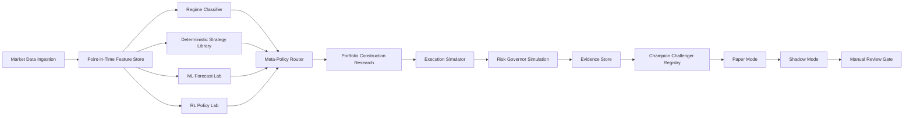
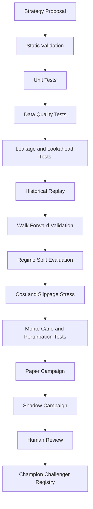

# Strategy V3 Research Blueprint

## Purpose

This document defines the research-plane architecture for the next strategy generation of the Autonomous Trading Bot repository.

The objective is not to promise guaranteed profit. No strategy can do that. The objective is to build a repeatable system for discovering, validating, rejecting, shadow-running, and promoting strategies under strict evidence gates.

This blueprint is intentionally separated from live order submission. New strategy logic must first pass deterministic tests, historical replay, walk-forward validation, stress testing, paper trading, and shadow evaluation.

---

## Competitive Scan: Ten Relevant Open-Source Systems

The shortlist below is popularity-weighted and architecture-focused rather than a strict ranking. These projects cover crypto automation, professional algorithmic engines, reinforcement-learning research, backtesting, and strategy operations.

| Project | Relevant Strength | Primary Lesson for This Repository |
|---|---|---|
| Freqtrade / FreqAI | Crypto strategy research, dry-run, backtesting, hyperparameter optimization, adaptive ML retraining, leakage analysis | Build an explicit research pipeline with walk-forward retraining, lookahead-bias tests, reproducible parameter searches, and dry-run-first promotion gates. |
| Hummingbot | Modular Strategy V2 architecture with executors, scripts, controllers, market-data providers, and multi-controller deployments | Separate strategy intent from execution workflows. Treat execution as a controlled subsystem, not as a side effect of signal generation. |
| QuantConnect LEAN | Algorithm Framework separation: universe selection, alpha, portfolio construction, execution, and risk management | Split the trading decision lifecycle into independently testable modules with explicit contracts. |
| NautilusTrader | Deterministic event-driven core shared across backtest, sandbox, paper, and live contexts | Preserve semantic parity across research and runtime environments. Avoid strategy rewrites between backtest and deployment. |
| Jesse | Straightforward strategy authoring, backtesting, optimization, and cross-validation | Keep strategy authoring ergonomic and transparent. Make parameter spaces explicit and reviewable. |
| FinRL | Three-layer financial reinforcement-learning architecture and multi-factor agent research | Keep RL isolated in an experimental policy lab until it beats deterministic baselines out of sample and under stress. |
| TensorTrade | Composable RL environments, actions, rewards, and data feeds | Define experimental policies through modular environment and reward contracts rather than hard-wired agent logic. |
| OctoBot | Configurable AI, grid, DCA, basket, and TradingView-connected strategy modes | Support multiple strategy families, but route them through one consistent validation and safety framework. Do not let an LLM directly bypass risk controls. |
| Superalgos | Visual strategy design, data mining, backtesting, paper trading, and distributed deployments | Preserve lineage: every strategy decision should be explainable, inspectable, and reproducible from recorded inputs. |
| vn.py | Broad quantitative-trading platform orientation and plugin ecosystem | Design clean plugin interfaces so strategy research can expand without coupling every new model to the execution core. |

---

## Current Repository Assessment

The repository already has meaningful safety and runtime foundations:

- paper and simulation modes;
- live-readonly support;
- manual live pilot gates;
- Coinbase execution adapter kill switch;
- ledger and reconciliation services;
- idempotency and execution locks;
- risk guard controls;
- operational readiness endpoints;
- worker separation and CI gates.

The current strategy layer is still an early baseline. Before this blueprint, the strategy stack had the following issues:

1. `StrategyEnsembleV2` imported `services.strategy_service_v2.StrategyServiceV2`, but that module was missing.
2. HOLD decisions could still be passed through notional shaping because the optimizer enforced a minimum value.
3. Regime classification was too simplistic and made range classification effectively uncommon.
4. The allocator selected the strongest single signal rather than requiring directional agreement.
5. The primary backtesting service still evaluates a moving-average crossover rather than the runtime strategy stack.
6. There is no research registry, model lineage store, feature versioning system, leakage gate, or champion/challenger promotion flow.

The first three defects are addressed or partially addressed on the `strategy-v3-foundation` branch. Consensus allocation remains a future paper-only implementation task.

---

## Target Architecture: Research Plane First

Live order submission is intentionally outside this research-plane diagram. Promotion into any live-capable path must remain a separately reviewed operational decision.

---

## Strategy Families

The strategy system should not depend on a single indicator, a single model, or a single market regime.

### 1. Trend and Momentum Family

Use for sustained directional regimes.

Candidate signals:

- EMA and SMA slope alignment;
- multi-horizon returns;
- breakout distance;
- volatility-adjusted momentum;
- trend persistence;
- drawdown recovery state.

### 2. Mean-Reversion Family

Use for range-bound regimes only.

Candidate signals:

- rolling z-score;
- RSI extension;
- Bollinger-style normalized distance;
- short-horizon reversal;
- spread or basis deviation where available.

### 3. Breakout and Volatility Expansion Family

Use when volatility compresses and subsequently expands.

Candidate signals:

- range compression percentile;
- realized-volatility ratio;
- price-channel breakout;
- volume confirmation;
- false-breakout rejection score.

### 4. Relative-Strength and Rotation Family

Use when the system supports a sufficiently broad, liquid universe.

Candidate signals:

- cross-sectional momentum;
- volatility-normalized ranking;
- liquidity threshold;
- correlation-aware diversification;
- turnover cost penalty.

### 5. Market-Microstructure Research Family

Paper and shadow evaluation only until high-quality order-book data exists.

Candidate signals:

- bid-ask spread;
- book imbalance;
- depth-weighted pressure;
- short-horizon trade-flow imbalance;
- adverse-selection estimates;
- venue-specific latency and fill-quality statistics.

### 6. ML Forecast Lab

Supervised models should estimate distributions or calibrated probabilities, not issue unrestricted orders.

Recommended early experiments:

- gradient-boosted trees as the baseline;
- regularized linear models as sanity checks;
- calibrated classifiers for directional probability;
- quantile regression for return distribution estimates;
- anomaly and outlier detectors for data-quality gates.

Model outputs must be treated as bounded research signals consumed by a deterministic policy layer.

### 7. RL Policy Lab

Reinforcement learning is a research track, not the default trading brain.

Use RL only after deterministic baselines exist. RL experiments must include:

- explicit action space;
- explicit reward function;
- transaction-cost penalties;
- drawdown penalties;
- turnover penalties;
- invalid-action handling;
- regime-split evaluation;
- reproducible seeds;
- strict out-of-sample review;
- shadow-only deployment until extensive evidence exists.

---

## Meta-Policy Router

The router selects which strategy families are eligible in each regime. It must be deterministic, auditable, and reviewable.

| Regime | Eligible Families | Disabled or Heavily Penalized Families |
|---|---|---|
| Trend Up | trend, breakout, relative strength | aggressive mean reversion |
| Trend Down | exit logic, defensive trend, selective breakout research | dip-buying without recovery evidence |
| Range | mean reversion, grid research, selective rotation | trend chasing |
| High Volatility | defensive mode, reduced exposure simulation, anomaly review | unrestricted entries and leverage |
| Unknown / Stale Data | HOLD only | all new entries |

Every routed decision should persist:

- feature-set version;
- regime label;
- eligible strategy families;
- model versions;
- raw signals;
- confidence calibration;
- risk decision;
- simulated execution result;
- rejection reason when blocked.

---

## Independent Risk Governor

The risk governor must remain separate from strategy generation. A strategy proposes; risk disposes.

Required research and runtime controls:

- stale-data rejection;
- missing-data rejection;
- symbol allowlist;
- liquidity floor;
- spread ceiling;
- maximum per-position exposure;
- maximum aggregate exposure;
- maximum correlated exposure;
- volatility-scaled exposure limits;
- daily loss limit;
- drawdown limit;
- capital floor;
- cooldown after losses or anomalies;
- maximum turnover;
- maximum order count;
- emergency halt;
- shadow-only fallback after repeated anomalies.

No ML model, RL policy, LLM, or strategy plugin may bypass the governor.

---

## Validation Pipeline

Minimum evidence package for each strategy version:

- source commit SHA;
- parameter set;
- feature-set version;
- training-window specification when ML is used;
- test-window specification;
- market universe;
- timeframe;
- benchmark comparison;
- fees and slippage assumptions;
- gross and net metrics;
- regime-split metrics;
- turnover;
- maximum drawdown;
- worst-day result;
- exposure distribution;
- rejection rate;
- data-quality incidents;
- deterministic replay checksum.

---

## Metrics That Matter

Do not optimize only for headline return.

Primary metrics:

- net return after costs;
- benchmark-relative return;
- maximum drawdown;
- downside deviation;
- profit factor;
- win/loss asymmetry;
- turnover;
- exposure time;
- strategy stability across windows;
- regime-specific performance;
- cost sensitivity;
- latency sensitivity;
- fill-quality sensitivity;
- probability calibration for ML outputs;
- drift metrics;
- anomaly rate.

Reject strategies that only work in one favorable historical slice.

---

## Data Architecture

Recommended collections or tables:

- `market_candles_v2`
- `market_ticks_v2`
- `order_book_snapshots_v2`
- `feature_vectors_v3`
- `feature_set_versions_v3`
- `strategy_definitions_v3`
- `strategy_runs_v3`
- `model_registry_v3`
- `model_training_runs_v3`
- `policy_evaluations_v3`
- `research_evidence_v3`
- `champion_challenger_v3`
- `shadow_decisions_v3`
- `risk_decisions_v3`
- `execution_simulations_v3`

All feature rows must be point-in-time safe. Future information may appear only in training labels, never in inference features.

---

## Implementation Roadmap

### Batch 1: Foundation Repair

- restore the missing `StrategyServiceV2` module;
- make HOLD preserve zero notional;
- strengthen regime classification;
- add deterministic tests;
- document the architecture.

### Batch 2: Strategy Registry and Replay

- define versioned strategy contracts;
- persist strategy metadata;
- add a runtime-strategy replay harness;
- compare runtime planner behavior against historical replay;
- persist evidence packages.

### Batch 3: Leakage and Robustness Gates

- add lookahead-bias detection;
- add point-in-time feature validation;
- add missing-candle and stale-candle tests;
- add perturbation and cost-sensitivity campaigns;
- add regime-split scorecards.

### Batch 4: Paper-Only Consensus Router

- replace winner-takes-all allocation with deterministic directional consensus;
- expose conflict diagnostics;
- persist strategy votes;
- force HOLD when confidence is low or signals conflict;
- add tests for contradictory strategies.

### Batch 5: Feature Store and Supervised ML Lab

- add versioned feature pipelines;
- add offline training jobs;
- add calibration checks;
- register model artifacts and metadata;
- make model predictions advisory-only;
- run champion/challenger comparisons.

### Batch 6: Shadow Policy Lab

- add shadow decision recording;
- add replayable simulation decisions;
- add ML and RL policy adapters behind feature flags;
- prohibit direct exchange execution;
- add operator review dashboards.

### Batch 7: Portfolio Research

- add multi-asset exposure research;
- add correlation-aware constraints;
- add turnover penalties;
- add liquidity-aware filters;
- add portfolio stress scenarios.

### Batch 8: Execution Research

- add fill-quality analytics;
- add fee and slippage models;
- add order-book-aware simulation where data quality permits;
- add market-impact approximation;
- compare naive and optimized execution in shadow mode.

---

## Non-Negotiable Rules

1. No guaranteed-profit claims.
2. No direct LLM-to-order path.
3. No RL policy may bypass deterministic risk controls.
4. No strategy reaches a live-capable path without historical replay, walk-forward evaluation, paper evidence, shadow evidence, and manual review.
5. Every model, feature set, strategy version, and policy decision must be reproducible.
6. HOLD is a first-class decision.
7. Stale, missing, or anomalous data must force a safe state.
8. Execution and strategy remain separate subsystems.
9. Risk controls remain independent and fail closed.
10. Evidence quality outranks complexity.
